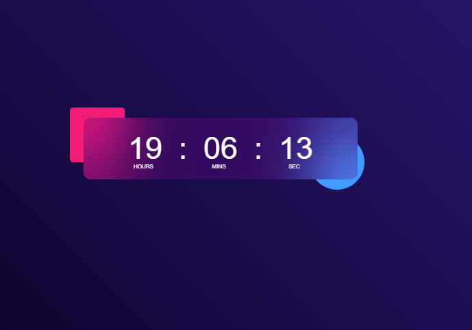

# Digital Clock Project



## <a name="tech-stack">⚙️ Tech Stack</a>

**Client:** HTML, CSS, JavaScript


## <a name="features">🔋 Features</a>

- Live previews
- Fullscreen mode

## Description

This project displays the current time in real-time and is a great example of basic DOM manipulation and styling. Simple, functional, and easy to understand for beginners.


## Run Locally

Clone the project

```bash
  git clone https://github.com/Semalgn/Digital-Clock-Project.git
```

Go to the project directory

```bash
  cd Digital-Clock-Project
```
Run index.html with liveserver.

🚀 Feel free to contact me!


